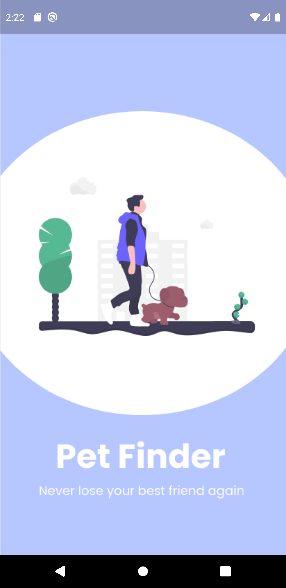
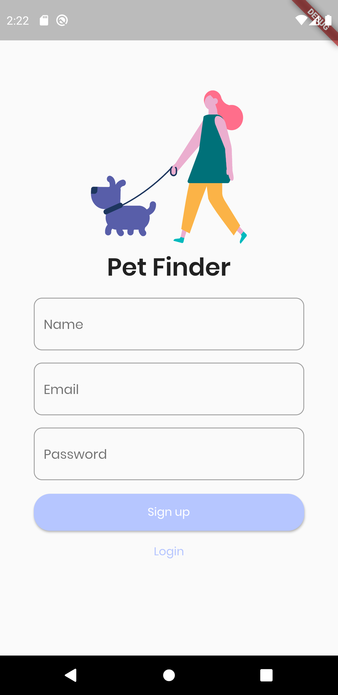
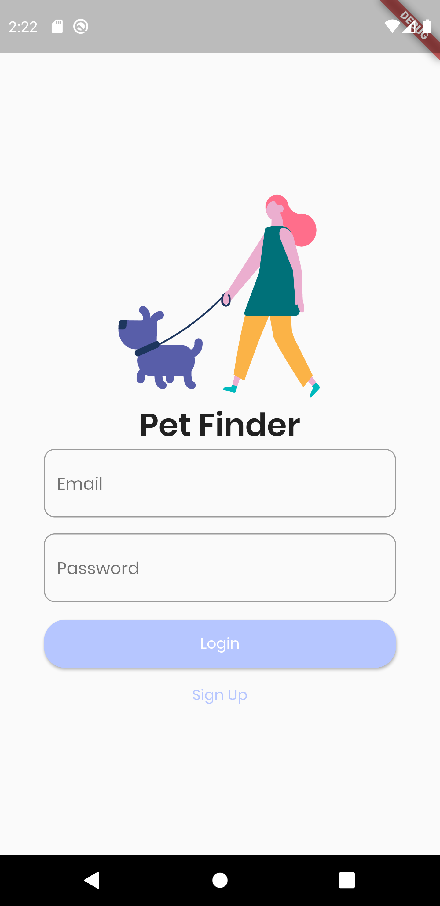
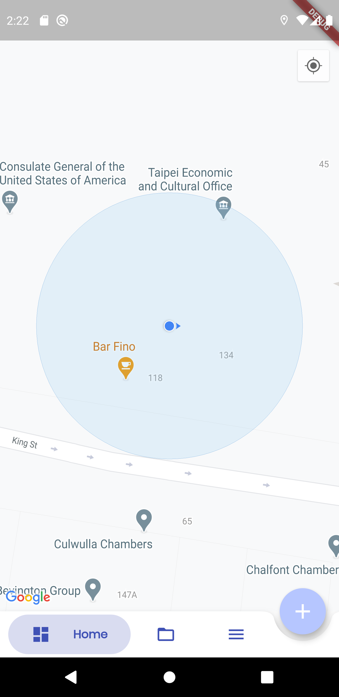
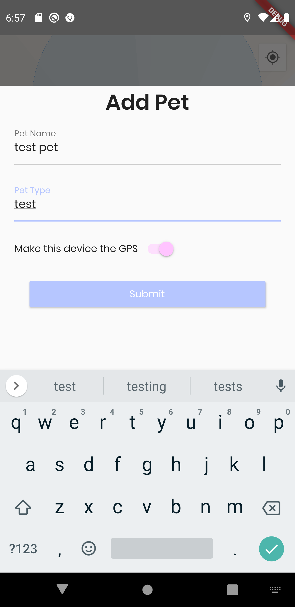

# Pet Tracker
Powered by

PetTracker is a cross platform mobile application that enables users to track their pets wherever they are!

# New Features!
 - Google Maps Integration
 - PolyLines between current user and pet's current location
 - Real-time location update of evey pet
### Tech

Pet Tracker uses a number of open source projects to work properly:

* [Flutter](https://flutter.dev/) - Google's Cross Platform mobile application framework.
* [Google Firebase](https://firebase.google.com/) - Google's cloud services such as authentication, firestore(think monngo-db), storage

### Todos

 - Add ability to register multiple devices
 - Create GPS module and stop using a mobile phone

### Screenshots

<table>
    <tr>
        <td></td>
        <td></td>
        <td></td>
    </tr>
    <tr>
        <td></td>
        <td></td>
    </tr>
</table>